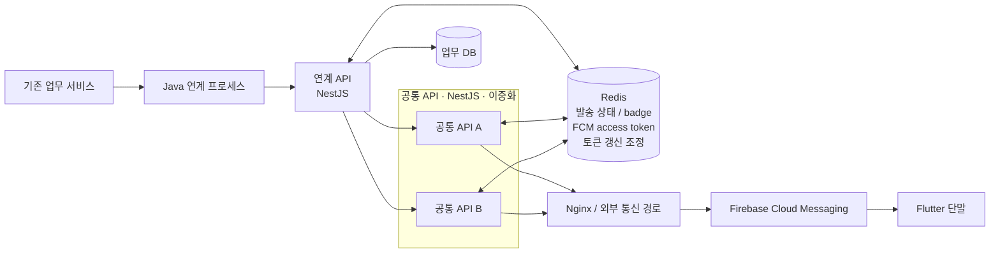

# Reliable Messaging Platform

[English](README.md) | **한국어**

실무에서 직접 설계·개발·운영한 FCM 알림 발송 경로를, 이직 준비를 하면서 공개 가능한 형태로 다시 정리한 저장소입니다.

새로운 메시징 제품을 만든 것이 아니라, 실제 운영 구조와 기록을 다시 보면서 **내가 겪은 문제, 판단한 이유, 바꾼 내용**을 남겼습니다. 회사 내부 자료를 그대로 옮기지는 않았지만, 공개를 이유로 실제 구조를 다른 구조처럼 바꾸지도 않았습니다.

문서 구조화, 가독성 개선, Mermaid 다이어그램 정리와 영문 번역에는 AI를 활용했습니다. 기술적 사실, 판단, 트러블슈팅 과정과 담당 범위는 실제 업무 경험과 기록을 기준으로 검토했습니다.

## 실제로 다뤘던 구조



공개 문서에서는 실제 서비스명 대신 `기존 업무 서비스`, `Java 연계 프로세스`, `연계 API`, `공통 API`처럼 역할이 바로 보이는 이름을 사용했습니다. 내부 주소, API path, Redis key와 운영 설정값은 제거했지만 **서비스 순서와 기술 경계는 실제 구조를 기준으로 유지했습니다.**

제가 직접 다룬 중심 범위는 Java 연계 이후의 Push 호출 구조, NestJS 연계 API와 공통 API의 FCM 발송 경로, Redis 상태 관리, FCM 연동, 모니터링과 장애 대응입니다. 기존 업무 서비스와 Flutter 단말의 내부 전체 구현을 제가 했다고 주장하지 않습니다.

## 2026-09 · FCM 1차 Reliability Refactoring

운영 장애와 기존 코드를 다시 확인하면서 시스템을 새로 만드는 대신, 기존 구조 안에서 **실패의 의미, 재시도 기준, 후처리 경계, correlation, Push 실행 자원**을 다시 정리했습니다.

핵심 변경:

- 결과를 `accepted / skipped_unregistered / delivery_unknown / failed`로 나눔
- FCM 요청 전 실패와 요청 시작 후 응답을 확인하지 못한 상태를 분리
- `500/503`은 제한적으로 Retry, `timeout/502/504`는 `delivery_unknown`으로 보고 자동 재발송하지 않음
- `UNREGISTERED` 재확인 과정의 다른 오류를 무효 토큰으로 잘못 확정하지 않도록 분기 보완
- FCM 결과를 먼저 확정하고 PushLog/Redis 상태 저장 같은 후처리 Failure Domain을 분리
- 공통 API가 결과 의미를 정의하고 연계 API가 typed 결과를 우선 해석
- Retry에서도 같은 `messageId`를 유지하고 `X-Message-Id`로 서비스·프록시 로그 correlation 보강
- 기존 Java 비동기 Event 구조는 유지하면서 Push 전용 Executor / HTTP Client만 격리
- Redis Command 실패와 Connection reconnect를 분리

현재 상태는 다음과 같습니다.

```text
Code Changes                  COMPLETE
Redis reconnect DEV           VALIDATED
전체 Refactoring DEV E2E      PENDING
Production Deployment         PENDING
Production Validation         PENDING
```

따라서 이 저장소는 지금 **코드에 반영한 구조와 판단**까지 설명합니다. 운영 안정화 완료, 중복 발송 제거, 효과 검증 완료라고 주장하지 않습니다.

자세한 변화는 [FCM 1차 리팩토링](docs/ko/09-fcm-refactoring-v1.md)에 정리했습니다.

## 운영하면서 바뀐 판단

- 발송 요청 안에서 FCM access token을 갱신하면 외부 OAuth 지연이 그대로 발송 지연으로 번질 수 있었습니다. 토큰을 Redis에 보관하고 발송과 갱신을 분리했습니다.
- 공통 API가 이중화되어 있어 프로세스 안의 중복 갱신과 인스턴스 사이의 중복 갱신을 따로 막았습니다.
- 다수 대상의 순차 발송은 지연이 누적됐습니다. 병렬 발송으로 바꾸되 `Promise.allSettled`로 한 건의 실패가 전체 발송을 멈추지 않게 했습니다.
- `messageId`를 서비스 구간 전체에 유지해 로그 연결과 발송 상태 확인에 사용했습니다.
- `UNREGISTERED`를 한 번 받았다고 바로 토큰을 비활성화하지 않고 한 번 재확인했습니다.
- 이번 1차 리팩토링에서는 **응답이 없다는 사실과 미전송이 확정됐다는 사실은 다르다**고 보고 `delivery_unknown`을 별도 상태로 만들었습니다.

## 문서

1. [정리 배경과 공개 범위](docs/ko/01-context-and-scope.md)
2. [실제 경험 구조](docs/ko/02-experience-architecture.md)
3. [메시지 발송 흐름](docs/ko/03-message-flow.md)
4. [FCM 토큰 갱신과 복구](docs/ko/04-token-refresh.md)
5. [실패 처리와 UNREGISTERED](docs/ko/05-failure-handling.md)
6. [모니터링과 로그](docs/ko/06-monitoring.md)
7. [장애 대응 기록](docs/ko/07-troubleshooting.md)
8. [운영에서 남은 판단과 한계](docs/ko/08-lessons-and-limitations.md)
9. [FCM 1차 리팩토링 — 실패와 재시도 기준을 다시 정리한 이유](docs/ko/09-fcm-refactoring-v1.md)

### 기술 판단 기록

- [`messageId`를 E2E 식별자로 사용](docs/ko/decisions/01-message-id.md)
- [Redis에 짧게 유지되는 공유 상태를 모음](docs/ko/decisions/02-redis-shared-state.md)
- [토큰 갱신을 발송 요청에서 분리](docs/ko/decisions/03-token-refresh-outside-send.md)
- [`UNREGISTERED`를 재확인 후 비활성화](docs/ko/decisions/04-unregistered-recheck.md)
- [`delivery_unknown`을 별도 결과로 둔 이유](docs/ko/decisions/05-delivery-unknown.md)
- [FCM 결과와 후처리 Failure Domain 분리](docs/ko/decisions/06-outcome-postprocessing-isolation.md)
- [기존 Async 구조에서 Push 실행 자원만 격리](docs/ko/decisions/07-push-resource-isolation.md)

## 다이어그램과 예제

[`diagrams/`](diagrams/README.md)에는 실제 공개 경계와 주요 흐름의 Mermaid 원본이 있습니다.

[`examples/nestjs/`](examples/nestjs/README.md)는 실제 운영 소스가 아닙니다. 실제 구조에서 사용한 역할과 판단을 작은 TypeScript 예제로 옮긴 것이며, 이번 리팩토링의 DEV/PROD 검증 상태보다 앞선 구현 증거로 사용하지 않습니다.

## 공개하지 않는 것

- 회사명, 조직명, 센터명, 내부 시스템명
- 실제 API 경로, 호스트명, IP, 세부 네트워크 구성
- 실제 Redis key, 운영 임계값과 실행 주기
- credential, token, secret, private key
- 운영 로그 원문과 민감한 payload
- 실제 사용자·단말 식별정보
- 회사 소스코드와 전체 운영 topology

## 이 저장소가 주장하지 않는 것

- FCM 성공 응답이 Flutter 단말 화면 표출 완료라는 보장
- 외부 Provider까지 포함한 exactly-once 발송
- 대규모 durable queue나 replay 기능
- 모든 메시징 서비스에 그대로 적용되는 정답 구조
- Flutter 앱 내부 전체 구현에 대한 소유권
- 현재 1차 리팩토링의 DEV/PROD 검증 완료

이 저장소의 목적은 시스템 설계 교재를 만드는 것이 아니라, **한 운영 시스템을 만들고 고치면서 판단이 어떻게 바뀌었는지 공개 가능한 선에서 남기는 것**입니다.
