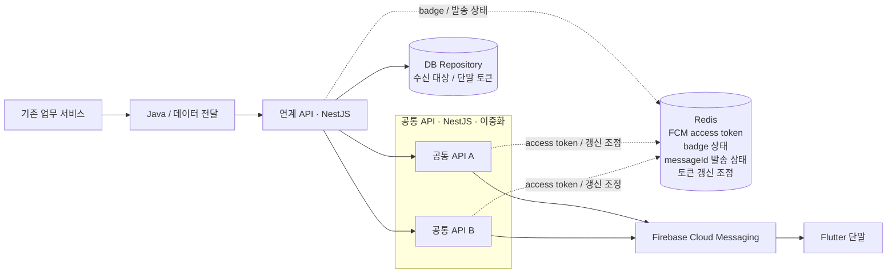

# Reliable Messaging Platform

[English](README.md) | **한국어**

실무에서 직접 설계·개발·운영한 FCM 알림 발송 경로를, 이직 준비를 하면서 공개 가능한 형태로 다시 정리한 저장소입니다.

새로운 메시징 제품을 만든 것이 아니라, 당시의 구조와 운영 기록을 다시 확인하면서 **내가 실제로 겪은 문제, 판단한 이유, 바꾼 내용**을 남겼습니다. 회사 내부 자료를 그대로 옮기지는 않았지만, 공개를 이유로 실제 구조를 다른 구조처럼 바꾸지도 않았습니다.

문서 구조화, 가독성 개선, Mermaid 다이어그램 정리, 영문 번역에는 AI를 활용했습니다. 다만 여기 적은 **사실, 기술적 판단, 트러블슈팅 과정과 담당 범위는 실제 업무 경험과 기록을 기준으로 다시 검토했습니다.** AI가 경력이나 장애 사례를 만들어 낸 것은 아닙니다.

## 실제로 다뤘던 구조

공개 문서에서는 실제 서비스명 대신 `기존 업무 서비스`, `Java/데이터 전달`, `연계 API`, `공통 API`처럼 역할이 바로 보이는 이름만 사용했습니다. 순서와 기술 경계는 실제 경험을 기준으로 했습니다.

제가 직접 다룬 중심 범위는 Java/데이터 전달 이후의 연계 API와 공통 API 서버 구간, DB 기반 수신 대상 조회, Redis 상태 관리, FCM 연동, 모니터링과 장애 대응입니다. 기존 업무 서비스와 Flutter 단말은 전체 흐름을 설명하기 위한 앞뒤 경계이며, 그 내부 전체를 제가 구현했다고 주장하지 않습니다.

## 운영하면서 실제로 바뀐 판단

- 발송 요청 안에서 FCM access token을 갱신하면 외부 OAuth 지연이 그대로 발송 지연과 504로 번졌습니다. 토큰을 Redis에 보관하고, 발송과 토큰 갱신을 분리했습니다.
- 공통 API가 이중화되어 있어 한 프로세스 안의 중복 갱신과 인스턴스 사이의 중복 갱신을 따로 막아야 했습니다. 프로세스 안에서는 Promise single-flight, 인스턴스 사이에서는 Redis 기반 조정을 사용했습니다.
- 다수 대상의 순차 발송은 대상 수만큼 지연이 누적됐습니다. 병렬 발송으로 바꾸되 `Promise.allSettled`로 한 건의 실패가 전체 발송을 멈추지 않게 했습니다.
- `messageId`를 서비스 구간 전체에 넘겨 로그 연결, 발송 상태 조회, 중복 요청 판단에 함께 사용했습니다.
- FCM의 `UNREGISTERED`를 한 번 받았다고 바로 토큰을 지우지 않았습니다. 한 번 재확인한 뒤 다시 `UNREGISTERED`일 때만 논리 비활성화하고 발송 계층에서는 `skipped`로 분류했습니다. 다만 상위 재시도 큐에는 이 상태 분기가 완전히 반영되지 않아, 무효 토큰도 제한된 재시도 범위 안에서 다시 큐에 들어갈 수 있는 구간이 현재 known gap으로 남아 있습니다.
- `queued`, `delivered`, `failed`, `skipped`를 나눠 보고, 발송 전체 시간만이 아니라 토큰 갱신·FCM 호출·Redis 구간을 따로 확인했습니다.

## 문서

1. [정리 배경과 공개 범위](docs/ko/01-context-and-scope.md)
2. [실제 경험 구조](docs/ko/02-experience-architecture.md)
3. [메시지 발송 흐름](docs/ko/03-message-flow.md)
4. [FCM 토큰 갱신과 복구](docs/ko/04-token-refresh.md)
5. [실패 처리와 UNREGISTERED](docs/ko/05-failure-handling.md)
6. [모니터링과 로그](docs/ko/06-monitoring.md)
7. [장애 대응 기록](docs/ko/07-troubleshooting.md)
8. [운영에서 남은 판단과 한계](docs/ko/08-lessons-and-limitations.md)

### 기술 판단 기록

- [`messageId`를 E2E 식별자로 사용](docs/ko/decisions/01-message-id.md)
- [Redis에 짧게 유지되는 공유 상태를 모음](docs/ko/decisions/02-redis-shared-state.md)
- [토큰 갱신을 발송 요청에서 분리](docs/ko/decisions/03-token-refresh-outside-send.md)
- [`UNREGISTERED`를 재확인 후 비활성화](docs/ko/decisions/04-unregistered-recheck.md)

## 다이어그램과 예제

[`diagrams/`](diagrams/README.md)에는 위 구조와 주요 흐름의 Mermaid 원본이 있습니다.

[`examples/nestjs/`](examples/nestjs/README.md)는 실제 운영 소스가 아닙니다. 연계 API, 공통 API, DB Repository, Redis 상태, FCM 호출이라는 실제 경계를 작은 TypeScript 예제로 옮긴 것입니다. 실제 경로, 키, 설정값과 인증정보는 넣지 않았습니다.

## 공개하지 않는 것

- 회사명, 조직명, 센터명, 내부 시스템명
- 실제 API 경로, 호스트명, IP, 네트워크 구성값
- 실제 Redis key, 운영 임계값과 실행 주기
- credential, token, secret, private key
- 운영 로그 원문과 민감한 payload
- 실제 사용자·단말 식별정보
- 회사 소스코드와 전체 운영 topology

예제의 이름과 값은 모두 공개용입니다. 다만 문서의 흐름, 문제, 판단, 해결 방향은 실제 경험에서 벗어나지 않도록 했습니다.

## 이 저장소가 주장하지 않는 것

- FCM이 성공 응답을 주면 사용자가 반드시 화면에서 알림을 봤다는 보장
- 외부 Provider까지 포함한 exactly-once 발송
- 대규모 durable queue나 replay 기능
- 모든 메시징 서비스에 그대로 적용되는 정답 구조
- Flutter 앱 내부의 수신·표출·토큰 재등록 구현 전체에 대한 소유권

이 저장소의 목적은 시스템 설계 교재를 만드는 것이 아니라, **한 운영 시스템을 만들고 고치면서 어떤 판단을 했는지 공개 가능한 선에서 설명하는 것**입니다.
