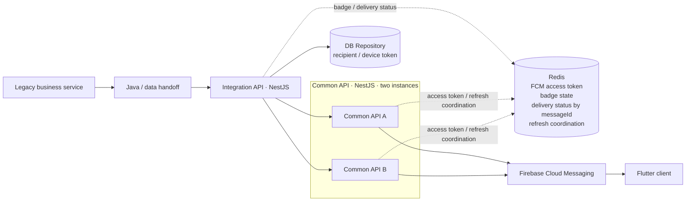

# Reliable Messaging Platform

**English** | [한국어](README.ko.md)

This repository documents an FCM notification path that I designed, developed, and operated in production, rewritten into a form I can share publicly while preparing for a career move.

It is not a newly invented messaging product. I reviewed my original work notes and kept the **problems I encountered, the decisions I made, and the changes I operated**. I removed proprietary details without replacing the real service boundaries with an idealized architecture.

I used AI to help structure the documents, improve readability, prepare Mermaid diagrams, and translate the English version. The **facts, technical decisions, troubleshooting process, and ownership statements are grounded in my actual work and were checked against my records.** AI was not used to invent experience or incidents.

## System I actually worked with

The public names describe roles only: legacy business service, Java/data handoff, integration API, and common API. The order and technology boundaries remain faithful to the system I worked on.

My direct scope centers on the NestJS server-side path after the Java/data handoff, DB-backed recipient lookup, Redis-backed operational state, FCM integration, monitoring, and incident response. The legacy service and Flutter client are the upstream and downstream boundaries of the end-to-end flow; I do not claim ownership of their entire internal implementations.

## Decisions that came from operating it

- Refreshing the FCM access token inside a live send request allowed OAuth latency to become delivery latency and eventually a 504. I moved the token into Redis and separated refresh from normal sending.
- Because the common API ran as two instances, refresh duplication had to be controlled both inside one process and across instances. I used promise-based single-flight locally and Redis-based coordination across instances.
- Sequential fan-out accumulated latency with each recipient. I changed it to parallel sending and used `Promise.allSettled` so one item failure would not stop the whole batch.
- I propagated `messageId` across service boundaries and used it for log correlation, delivery-state lookup, and duplicate-request handling.
- I did not deactivate a device token after one FCM `UNREGISTERED` response. The sender confirms once; only a second `UNREGISTERED` logically deactivates the token and classifies that send as `skipped`. A known gap remains in the upper retry queue: its status branching is not yet complete, so a confirmed invalid token can still be re-queued within the bounded retry path.
- I monitored `queued`, `delivered`, `failed`, and `skipped` separately, then split timing by token refresh, FCM call, and Redis work instead of relying on one HTTP duration.

## Documentation

1. [Context and disclosure boundary](docs/en/01-context-and-scope.md)
2. [Experience architecture](docs/en/02-experience-architecture.md)
3. [Message flow](docs/en/03-message-flow.md)
4. [FCM token refresh and recovery](docs/en/04-token-refresh.md)
5. [Failure handling and UNREGISTERED](docs/en/05-failure-handling.md)
6. [Monitoring and logs](docs/en/06-monitoring.md)
7. [Troubleshooting records](docs/en/07-troubleshooting.md)
8. [Lessons and limitations](docs/en/08-lessons-and-limitations.md)

### Decision records

- [Use `messageId` as the end-to-end identity](docs/en/decisions/01-message-id.md)
- [Keep short-lived shared state in Redis](docs/en/decisions/02-redis-shared-state.md)
- [Move token refresh outside the send path](docs/en/decisions/03-token-refresh-outside-send.md)
- [Confirm `UNREGISTERED` before deactivation](docs/en/decisions/04-unregistered-recheck.md)

## Diagrams and example

[`diagrams/`](diagrams/README.md) contains the Mermaid source for the actual public boundaries and flows.

[`examples/nestjs/`](examples/nestjs/README.md) is not production source code. It is a small TypeScript example shaped around the real integration API, common API, DB repository, Redis state, and FCM boundaries. It contains no real routes, keys, configuration, or credentials.

## What is not published

- company, organization, site, or internal system names,
- real API paths, hostnames, IP addresses, or network configuration,
- real Redis keys, operating thresholds, or schedules,
- credentials, tokens, secrets, or private keys,
- production log lines or sensitive payloads,
- real user or device identifiers,
- company source code or the complete production topology.

All sample names and values are public placeholders. The flow, problems, decisions, and resolution directions remain grounded in the actual experience.

## What this repository does not claim

- proof that an end user displayed a notification after FCM accepted it,
- exactly-once delivery across an external provider,
- durable large-scale queueing or replay,
- a universal architecture for every messaging product,
- ownership of the Flutter client's entire reception, display, and token-registration implementation.

The purpose is not to write a messaging textbook. It is to explain, within a safe disclosure boundary, **how I built and changed one operated system and why those decisions were made**.
