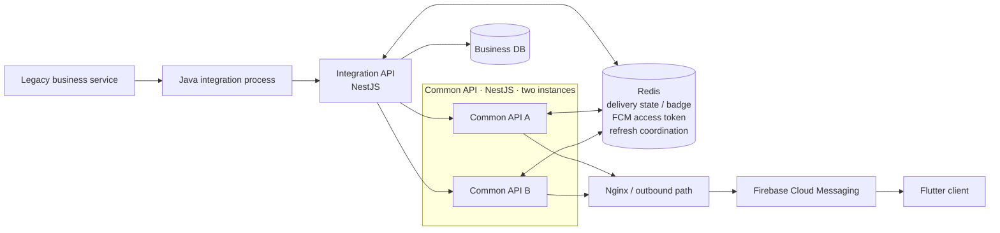

# Reliable Messaging Platform

**English** | [한국어](README.ko.md)

This repository documents the FCM notification path I designed, developed, and operated, together with the **Flutter mobile app I directly built at the receiving end**, rewritten into a form I can share publicly while preparing for a career move.

It is not a newly invented messaging product. I reviewed the real operating structure and records and kept the **problems I encountered, the decisions I made, and the changes I implemented**. Proprietary details are removed without replacing the real service boundaries with an idealized architecture.

I used AI to help structure the documentation, improve readability, prepare Mermaid diagrams, and translate the English version. Technical facts, decisions, troubleshooting steps, and ownership boundaries were reviewed against my actual work and records.

## System I actually worked with



Public names describe roles only. Internal routes, hosts, Redis keys, and operating values are removed, while the service order and technology boundaries remain faithful to the system I worked on.

My direct scope centers on the Push path after the Java integration boundary, the NestJS integration and common APIs used for FCM sending, Redis-backed state, FCM integration, monitoring, and incident response. **I also directly developed and built the Flutter mobile app that consumes these notifications.** I do not claim ownership of the legacy business service as a whole. This repository focuses on the messaging-server path, so detailed Flutter app internals are intentionally outside its documentation scope.

## 2026-09 · FCM Reliability Refactoring v1

After reviewing operating incidents and the existing code, I kept the deployed boundaries and changed the semantics around **failure, retry, post-processing, correlation, and Push resource isolation**.

Key changes:

- outcomes are now `accepted / skipped_unregistered / delivery_unknown / failed`,
- failures before an FCM request are separated from requests that started but returned no confirmed response,
- `500/503` remain bounded retry candidates, while `timeout/502/504` are treated as `delivery_unknown` and are not automatically resent,
- UNREGISTERED confirmation paths distinguish invalid-token evidence from other errors,
- the FCM outcome is finalized before PushLog/Redis status post-processing,
- the common API defines typed result semantics and the integration API consumes them first,
- retries keep the same `messageId`, with `X-Message-Id` used for service/proxy correlation,
- the existing Java async event flow remains, while Push gets its own executor and HTTP client,
- Redis command failure and connection recovery are treated separately.

Current validation status:

```text
Code Changes                  COMPLETE
Development Deployment        COMPLETE
Normal Push E2E Smoke Test     PASS
Redis reconnect DEV           VALIDATED
Failure-path DEV Validation    PENDING
Production Deployment         PENDING
Production Validation         PENDING
```

This repository therefore documents the implemented code and current decisions, not a claim that production stabilization or outcome improvements have already been verified.

See [FCM Reliability Refactoring v1](docs/en/09-fcm-refactoring-v1.md).

## Documentation

1. [Context and disclosure boundary](docs/en/01-context-and-scope.md)
2. [Experience architecture](docs/en/02-experience-architecture.md)
3. [Message flow](docs/en/03-message-flow.md)
4. [FCM token refresh and recovery](docs/en/04-token-refresh.md)
5. [Failure handling and UNREGISTERED](docs/en/05-failure-handling.md)
6. [Monitoring and logs](docs/en/06-monitoring.md)
7. [Troubleshooting records](docs/en/07-troubleshooting.md)
8. [Lessons and limitations](docs/en/08-lessons-and-limitations.md)
9. [FCM Reliability Refactoring v1](docs/en/09-fcm-refactoring-v1.md)

### Decision records

- [Use `messageId` as the end-to-end identity](docs/en/decisions/01-message-id.md)
- [Keep short-lived shared state in Redis](docs/en/decisions/02-redis-shared-state.md)
- [Move token refresh outside the send path](docs/en/decisions/03-token-refresh-outside-send.md)
- [Confirm `UNREGISTERED` before deactivation](docs/en/decisions/04-unregistered-recheck.md)
- [Represent ambiguous delivery as `delivery_unknown`](docs/en/decisions/05-delivery-unknown.md)
- [Separate provider outcome from post-processing failure](docs/en/decisions/06-outcome-postprocessing-isolation.md)
- [Isolate Push resources without replacing the existing async flow](docs/en/decisions/07-push-resource-isolation.md)

## Diagrams and example

[`diagrams/`](diagrams/README.md) contains Mermaid source for the public representation of the real boundaries and flows.

[`examples/nestjs/`](examples/nestjs/README.md) is not production source code and is not evidence beyond the validation state documented here.

## What is not published

- company, organization, site, or internal system names,
- real API paths, hostnames, IP addresses, or detailed network configuration,
- real Redis keys, thresholds, or schedules,
- credentials, tokens, secrets, or private keys,
- production log lines or sensitive payloads,
- real user or device identifiers,
- company source code or the complete production topology.

## What this repository does not claim

- proof of Flutter display after FCM accepted a request,
- exactly-once delivery across an external provider,
- durable large-scale queueing or replay,
- a universal messaging architecture,
- complete documentation of the Flutter client's internal implementation,
- completed failure-path DEV validation or production validation for the current refactoring.

The purpose is not to write a messaging textbook. It is to show, within a safe disclosure boundary, **how one operated system evolved as incidents changed my engineering decisions**.
