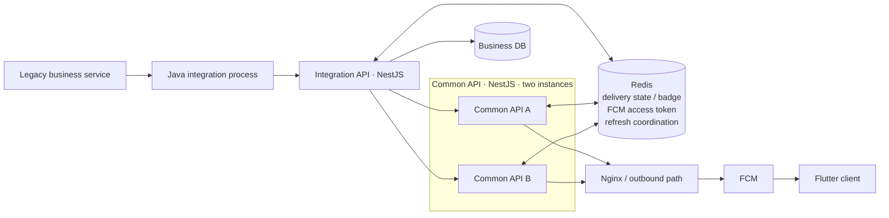

# Experience Architecture

## End-to-end structure



This is not an idealized redesign. Internal names and addresses are generalized, while the service order and technology boundaries remain faithful to the system I worked on.

## Java integration process

The Java path receives the business event and forwards the Push request to the NestJS integration API. Push execution was already behind an asynchronous event flow before this refactoring.

The 2026-09 change therefore did not convert a synchronous sender into an asynchronous one. It kept the event structure and isolated a Push-specific executor and HTTP client.

## Integration API — NestJS

The integration API receives the request, resolves recipient/device context, manages `messageId` and delivery state, calls the common API, interprets the returned outcome, and decides whether a retry queue is appropriate.

After the refactoring it prefers the common API's typed `status / retryable / deliveryUnknown` semantics over a local HTTP-status-only interpretation.

## Common API — NestJS, two instances

The common API performs the FCM provider call.

```text
read FCM access token / send context
→ call FCM
→ interpret provider response
→ finalize outcome
→ run logging / Redis post-processing
```

Because two instances operate together, access-token refresh coordination, Redis readiness, and instance-specific evidence are treated separately from process liveness.

## Redis

Redis holds short-lived shared state such as the FCM access token, delivery state, badge/send context, and refresh coordination. It is not presented as a durable messaging broker.

## Nginx / outbound path

The provider call crosses an outbound path. During incidents I inspected connection and response evidence here rather than relying on application HTTP status alone.

## FCM result boundary

The current internal outcome model is:

```text
accepted
skipped_unregistered
delivery_unknown
failed
```

`accepted` means the server observed a successful FCM response. It does not prove display on the Flutter client.

## No invented deployment components

Responsibilities are described inside the real integration API, common API, Redis, outbound path, and FCM boundaries. I do not introduce abstract components as if they had been separately deployed.
