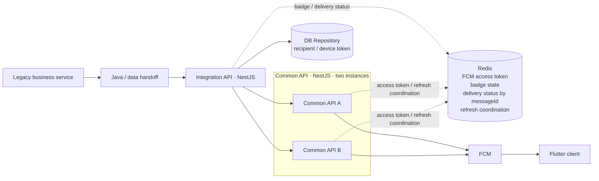

# Experience Architecture

## End-to-end structure



This is not an idealized redesign for publication. I generalized internal names, addresses, and API paths while keeping the **actual call order and technology boundaries** I worked with.

## 1. Legacy business service

This is where the business event requiring a notification begins. The public version omits the business domain, screen, site, and internal system name.

I do not claim ownership of the entire legacy application. It is shown only as the upstream boundary of the messaging flow.

## 2. Java / data handoff

The existing request data is passed from the legacy side into the integration API. The same `messageId` continues into the NestJS services and delivery result.

Internal class names and transfer routes are withheld, but this boundary remains visible because removing it would change the end-to-end flow I actually operated.

## 3. Integration API — NestJS

This server-side boundary prepares the request for delivery and forwards it to the common API.

The operational flow I worked with was roughly:

```text
receive request
→ inspect existing delivery status by messageId
→ look up recipient / device token through a DB repository
→ read required badge state
→ call the common API
→ record delivered / failed / skipped
```

Multi-recipient work was changed from sequential processing to parallel processing. `Promise.allSettled` kept one failed item from stopping the remaining sends and preserved per-item outcomes.

## 4. DB Repository

Recipient and device-token lookup came from a database repository, not from Redis.

I keep that distinction in the public architecture because replacing everything with a generic “recipient store” would no longer describe the structure I actually built.

Real user identifiers, tables, columns, and query conditions are withheld.

## 5. Common API — NestJS, two instances

The integration API calls one of two common API instances, and that common API sends the FCM request.

Running two instances created its own operational problems:

- both instances could attempt the same FCM access-token refresh,
- concurrent requests inside one process could also duplicate refresh work,
- incident analysis became unreliable when logs were not separated by instance,
- a running process did not mean sending was healthy if its Redis connection had not recovered.

I used promise-based single-flight inside a process, Redis-based refresh coordination across instances, and observed process health separately from Redis, OAuth, and FCM readiness.

## 6. Redis

Redis was not the recipient database and was not used to imitate a message broker. It held short-lived operational state shared by the server-side flow.

| Use | Why it was needed |
|---|---|
| FCM access token | Avoid an external OAuth call on every normal send |
| Badge state | Keep short-lived state required for badge handling |
| Delivery status by `messageId` | Connect queued / delivered / failed / skipped state |
| Refresh coordination | Prevent the two common API instances from refreshing the same token together |

Real keys, TTLs, lock durations, badge rules, and schedules are not published.

## 7. FCM

The common API uses a valid access token from Redis and sends the FCM HTTP request. Provider responses are handled according to delivery state and retry semantics rather than reduced to one binary error count.

FCM accepting the request is not proof that the user saw the notification on the Flutter device. `delivered` in this repository stops at the server-confirmed FCM response.

## 8. Flutter client

The Flutter app is the downstream boundary of the flow. The server works with device-token and badge state, but this repository does not expand that into a claim of ownership over every client-side reception, display, or token-registration detail.

## Abstractions intentionally removed

An earlier draft used names such as `Delivery Coordinator` and `Recipient Registry` as if they were independent components. They were useful for explaining responsibilities but could look like deployed services I never actually had.

This version keeps the explanation inside the actual **integration API, DB repository, common API, Redis, and FCM** boundaries.
