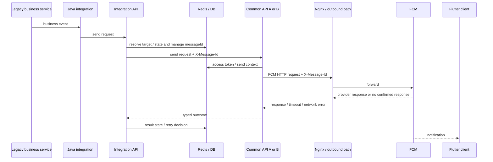

# Message Flow

## Normal path



## Correlation

Retries keep the original `messageId`. `X-Message-Id` extends the same correlation into HTTP and proxy evidence. The real ID format is not published.

## Outcome model

```text
accepted
skipped_unregistered
delivery_unknown
failed
```

`delivery_unknown` represents a request that may have started or reached an intermediate/provider boundary but returned no confirmed response.

## Request-start boundary

A missing response alone is not enough to classify a result as `delivery_unknown`, because failures can also happen before the FCM call.

```text
failure before FCM request
→ failed / retryable decision

FCM request started
+ no response
→ delivery_unknown
→ no automatic retry
```

## Retry semantics

| Condition | Outcome | Automatic retry |
|---|---|---|
| 500 / 503 | failed | bounded |
| timeout / 502 / 504 | delivery_unknown | no |
| ECONNREFUSED / ENOTFOUND / EAI_AGAIN | failed | conditionally |
| response-less transport error after request start | delivery_unknown | no |
| confirmed UNREGISTERED | skipped_unregistered | no |

The policy prioritizes duplicate-delivery risk instead of treating every transient-looking error as a reason to resend.

## Validation status

```text
Code Changes                  COMPLETE
Development Deployment        COMPLETE
Normal Push E2E Smoke Test     PASS
Redis reconnect DEV           VALIDATED
Failure-path DEV Validation    PENDING
Production Deployment         PENDING
Production Validation         PENDING
```
