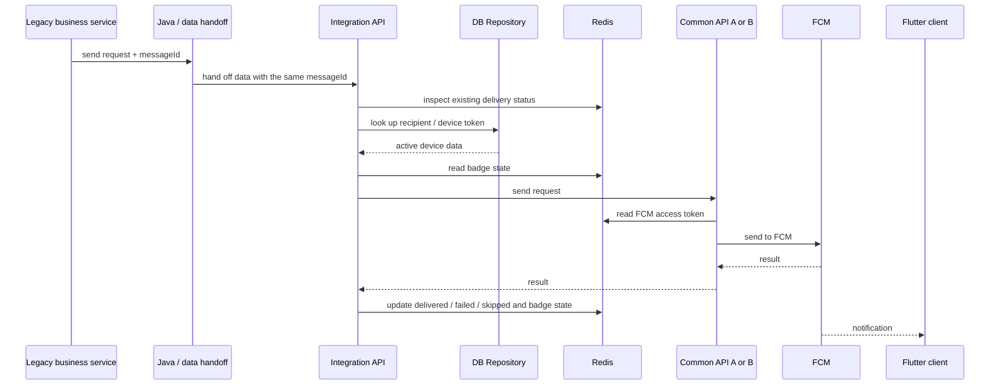

# Message Flow

## Normal path



Internal service names and routes are removed, but the **call order is kept faithful to the operated system**.

## Why `messageId` stays end to end

Per-service HTTP request IDs looked sufficient until incidents required the Java/data handoff, integration API, common API, Redis state, and FCM result to be joined into one send.

I use `messageId` for:

- log correlation across the NestJS path and FCM result,
- delivery-status lookup in Redis,
- duplicate-request detection,
- confirming that retry or operator action refers to the original send.

```text
same messageId + equivalent request
→ inspect the existing in-progress or terminal state
→ do not create a new logical send
```

This does not provide exactly-once behavior across FCM. It reduces the risk that an upstream retry or timeout becomes an unintended new logical send.

## DB lookup and Redis state are separate

Recipient and device-token lookup is performed through a DB repository. Redis keeps only the short-lived operational state needed by the send path.

```text
DB Repository
→ recipient / device token

Redis
→ FCM access token
→ badge state
→ delivery status by messageId
→ token-refresh coordination
```

This distinction is not a public redesign; it reflects the actual separation I worked with.

## Multi-recipient sending

The initial path sent recipients sequentially. Device testing showed that total arrival time grew with recipient count, so I changed the work to parallel processing.

```text
request list
→ parallel per-item send
→ Promise.allSettled
→ delivered / skipped / failed aggregation
```

The important change was not only speed. One recipient lookup or FCM failure no longer stopped the remaining sends.

## Delivery state

```text
queued
  ├─ delivered : FCM accepted the request
  ├─ skipped   : not eligible or classified as non-retryable in the sender layer
  └─ failed    : requires retry, recovery, or further confirmation
```

`skipped` and `failed` remain separate because they require different operator actions.

## Timeout and retry

Timeout is ambiguous because the server may fail to receive a response even after FCM accepted the request.

Retry decisions therefore consider:

1. whether the failure is transient,
2. whether existing `messageId` state can be inspected,
3. whether another send is acceptably safe,
4. whether the bounded retry budget remains.

After confirmation, `UNREGISTERED` is classified as `skipped` in the sender layer. A **known gap remains in the upper retry queue**: its status branching is not yet complete, so a confirmed invalid token can still be re-queued within the bounded retry path. See [Failure Handling and UNREGISTERED](05-failure-handling.md).

## Delivery-result boundary

`delivered` here means that FCM accepted the server request. It does not claim that the Flutter device displayed the notification to the user.
