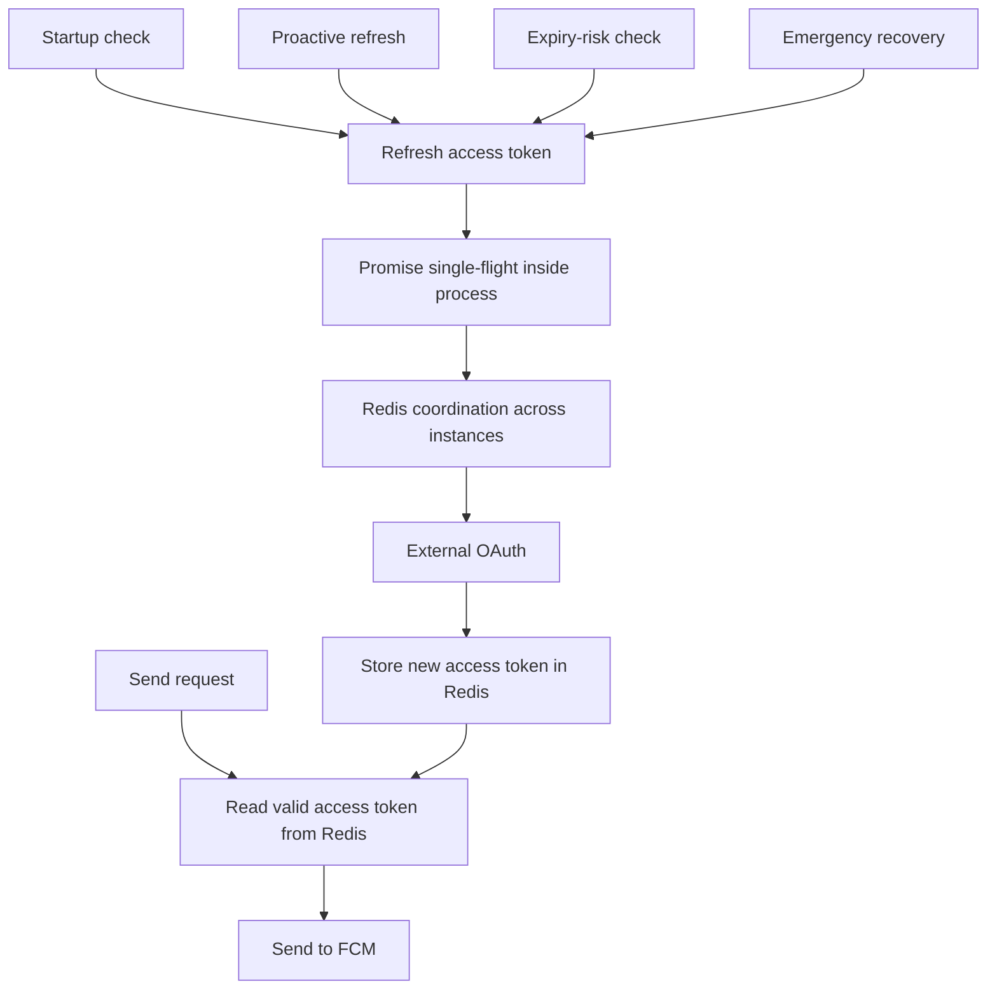

# FCM Access-Token Refresh and Recovery

## The first operational failure

The initial path obtained a new FCM access token from external OAuth when a send request found the token missing or expired.

```text
send request
→ check access token
→ missing or expired
→ call external OAuth
→ send to FCM
```

The service was healthy just after restart, but 504s began to appear as the access-token expiry window approached. I first checked Nginx, Redis, FCM, device tokens, and the network. When the symptoms were not enough to confirm a cause, I added timing around each stage.

Redis work and the FCM call were normal. The external OAuth request before FCM was slow, and its delay propagated through the common API to the upstream timeout.

## Caching was not the end of the problem

I first stored the access token in Redis. That reduced OAuth calls during the normal window, but at expiry both common API instances could observe the same cache miss and refresh together.

```text
Common API A ─┐
              ├─ same access token expires → concurrent OAuth calls
Common API B ─┘
```

A cache stores a value; it does not decide who refreshes it. I separated two concurrency scopes:

- inside one process: share the in-flight promise with single-flight,
- across the two instances: coordinate refresh with Redis `SET NX` and an expiry.

Exact keys and timing values are not published.

## Separating send from refresh



Normal sends use a valid token already held in Redis. Refresh happens through four operated paths:

- startup checks for a missing or near-expiry token,
- proactive refresh runs before expiry and is staggered between instances,
- a watchdog checks remaining lifetime rather than assuming the schedule succeeded,
- emergency recovery is a bounded last path when the token is unavailable or near expiry.

If OAuth is temporarily unhealthy while the cached token remains valid, sending can continue. This isolates impact for a limited window; it does not remove the dependency failure.

## Application mitigation versus root-cause repair

A later incident increased token-refresh failures even with these protections. I repeated the same request at the host, container, proxy, and external OAuth boundaries to find where behavior changed.

An outbound-policy change had made the container-to-OAuth path unreliable. The network team corrected that policy. My Redis, retry, watchdog, and recovery changes were application-side impact mitigation; the network-policy change was the root-cause repair. I keep those ownership statements separate.

## What I monitored

- whether Redis held a valid access token,
- remaining lifetime and entry into the risk window,
- scheduled refresh execution and actual refresh result,
- consecutive failures and emergency recovery,
- refresh timing on both instances,
- the Redis coordination result,
- external OAuth latency and errors.

Sending can still look healthy while repeated refresh failures move the token toward expiry. Delivery results and token health therefore need separate views.

## The lesson

> Storing an access token in Redis was only the first step. Operating it required pre-expiry refresh, concurrency control, and an explicit recovery path.
