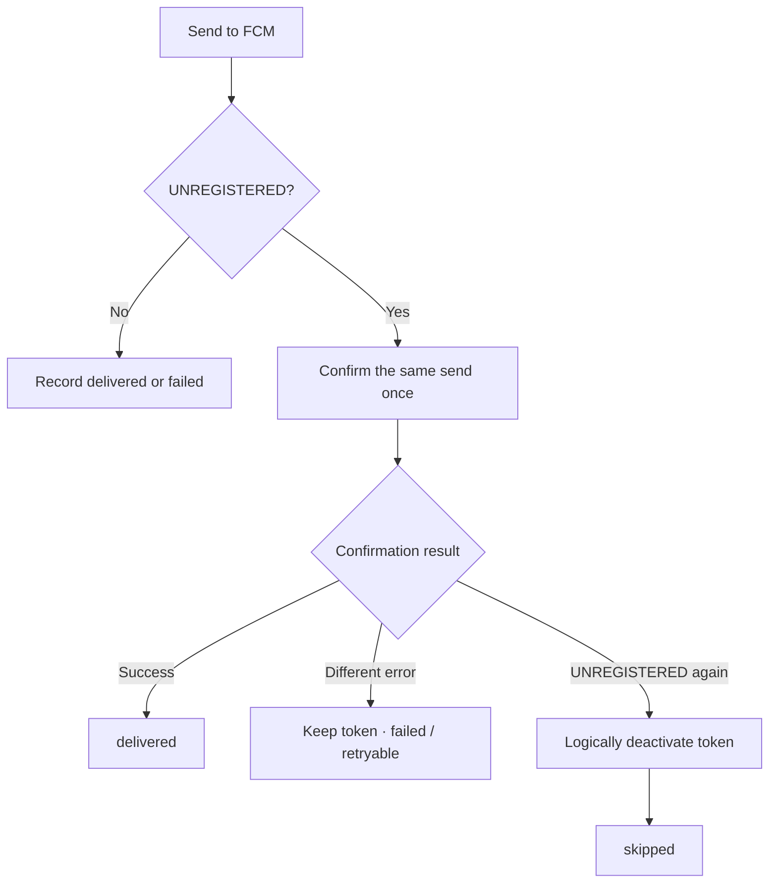

# Failure Handling and UNREGISTERED

## Why one failure count was not enough

A binary FCM success/failure view looked simple, but different negative results required different actions.

```text
delivered  FCM accepted the request
failed     transient or still-unconfirmed failure
skipped    ineligible target or non-retryable result
```

After an app uninstall or reinstall, an old device token may no longer be valid. Counting FCM `UNREGISTERED` with timeouts and 5xx responses polluted the infrastructure-failure signal and encouraged useless retries.

## Current UNREGISTERED path

The service does not deactivate a device token after the first `UNREGISTERED`.



1. Keep the token after the first `UNREGISTERED`.
2. Confirm the same send once.
3. If confirmation succeeds, record `delivered`.
4. If confirmation returns a different error, do not assume that the token is invalid; retain it and record a retry-evaluable `failed` result.
5. If confirmation is also `UNREGISTERED`, treat the token as invalid.
6. Deactivate it logically rather than physically deleting the history.
7. Record the send as `skipped` in the sender layer and exclude the token from future active recipients.

The real confirmation delay, database field, internal status codes, and API response values are not published.

## Why not delete immediately

A device token is important state connecting a user and a send. Deleting it from one response could deactivate a healthy token after a transient provider anomaly. Keeping a confirmed invalid token forever would repeatedly fail.

I accepted one additional confirmation call and kept history through logical deactivation.

## Retry decisions

| Situation | Handling | Retry |
|---|---|---|
| Successful FCM response | delivered | No |
| Confirmed UNREGISTERED | deactivate + sender-level skipped | Intended: no* |
| Timeout / transient 5xx | failed | Conditional after `messageId` and retry-limit checks |
| Invalid request | failed | Not unchanged |
| Access token unavailable | inspect token recovery | Use bounded recovery path |
| Unconfirmed cause | failed / unknown reason | Investigate before automatic repetition |

A timeout is particularly ambiguous because FCM may have received the request. Normal retries do not proceed without considering existing `messageId` state.

### Current known gap

The sender classifies a confirmed `UNREGISTERED` as non-retryable. The upper retry queue does not yet branch on that status completely, so a logically deactivated invalid token can still be re-queued within the bounded retry path.

The “no retry” row above therefore describes the **intended sender classification**, not a claim that the whole current path is already free of redundant retry. I keep this gap visible as an improvement item.

## Monitoring separation

`skipped` is separated from the failure rate, but not hidden.

- rising `failed`: inspect FCM, OAuth, Redis, and network dependencies,
- rising `skipped`: inspect installation and device-token lifecycle,
- rising confirmation successes: inspect possible transient anomalies,
- rising deactivations: inspect the client re-registration path.

Separating states by the operator's next action made incident triage faster.
