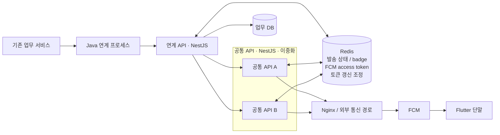

# 실제 경험 구조

## 전체 구조



이 그림은 이상적인 구조를 새로 만든 것이 아니다. 실제 내부 이름과 주소만 일반화하고,
서비스 순서와 기술 경계는 실제 운영 구조를 기준으로 유지했다.

## 1. 기존 업무 서비스

알림이 필요한 업무 이벤트가 시작되는 구간이다. 공개 문서에서는 업무 종류, 화면명,
센터명과 내부 시스템명을 적지 않는다.

기존 업무 서비스 전체를 내가 신규 개발했다고 주장하지 않는다.

## 2. Java 연계 프로세스

기존 업무 서비스의 요청을 받아 Push 이벤트를 만들고 HTTP로 NestJS 연계 API까지 전달한다.

리팩토링 전부터 Push 호출은 비동기 Event 흐름 뒤에서 실행되고 있었다. 이번 1차 리팩토링은
이를 새 비동기 구조로 바꾼 것이 아니라, 기존 Event 흐름은 유지하면서 Push 전용 Executor와
HTTP Client를 분리한 작업이다.

## 3. 연계 API — NestJS

연계 API는 발송에 필요한 업무 데이터를 받아 다음 처리를 담당한다.

```text
요청 수신
→ 사용자 / 단말 조회
→ messageId 생성·유지
→ 발송 상태와 badge 처리
→ 공통 API 호출
→ 공통 API 결과 해석
→ retry_queue 판단
```

리팩토링 이후에는 공통 API가 내려주는 `status / retryable / deliveryUnknown` 의미를 우선 해석한다.
`delivery_unknown`은 "실패했으니 다시 보낸다"가 아니라, 이미 전달됐을 가능성이 있어 자동 재발송하지 않는 상태다.

## 4. 공통 API — NestJS, 이중화

공통 API는 두 인스턴스로 운영하며 실제 FCM 발송 요청을 수행한다.

```text
FCM access token 확인
→ badge / 발송 문맥 확인
→ FCM 요청
→ Provider 결과 해석
→ outcome 확정
→ 로그 / Redis 상태 후처리
```

이중화 때문에 access token 갱신은 한 프로세스 안과 인스턴스 사이를 따로 조정했다.
또 프로세스가 실행 중이어도 Redis 연결이 복구되지 않으면 발송 기능은 정상이라고 볼 수 없었다.

## 5. Redis

Redis는 메시지 브로커를 흉내 내기 위해 넣은 것이 아니다. 여러 서버가 짧게 공유해야 하는
상태를 관리하기 위해 사용했다.

| 쓰임 | 역할 |
|---|---|
| FCM access token | 정상 발송이 매번 외부 OAuth를 기다리지 않게 함 |
| 발송 상태 | `messageId` 기준 처리 상태 확인 |
| badge / 발송 문맥 | 발송 전후 상태 관리 |
| 토큰 갱신 조정 | 두 공통 API 인스턴스의 동시 갱신 방지 |
| connection state | 장애 시 reconnect와 readiness를 별도로 확인 |

실제 key, TTL, lock 시간과 갱신 주기는 공개하지 않는다.

## 6. Nginx / 외부 통신 경로

공통 API와 FCM 사이에는 외부 통신 경로가 있다. 운영 장애에서 timeout과 499/5xx를 볼 때
애플리케이션 로그만으로 판단하지 않고 이 구간의 connection과 response 여부도 함께 확인했다.

실제 네트워크 주소와 정책은 공개하지 않는다.

## 7. FCM

공통 API는 유효한 access token으로 FCM HTTP 요청을 보낸다.

1차 리팩토링 이후 내부 결과 의미는 다음 네 가지로 본다.

```text
accepted
skipped_unregistered
delivery_unknown
failed
```

`accepted`는 FCM의 정상 응답을 확인했다는 의미다. Flutter 단말 화면에 표시됐음을 보장하지 않는다.

## 8. Flutter 단말

Flutter 앱은 발송 경로의 최종 소비자다. 서버 발송 구조를 설명하기 위해 경계로 표시하지만,
앱 내부 수신·표출·토큰 재등록 전체를 이 저장소의 소유 범위로 확장하지 않는다.

## 실제에 없는 컴포넌트는 만들지 않는다

책임을 설명하기 쉽다는 이유로 `Delivery Coordinator`, `Recipient Registry` 같은 가상의
배포 컴포넌트를 실제 구조처럼 두지 않는다. 책임은 연계 API, 공통 API, Redis, FCM이라는
실제 경계 안에서 설명한다.
