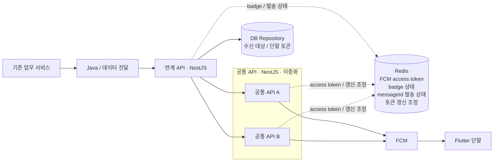

# 실제 경험 구조

## 전체 구조



이 그림은 공개용으로 이상적인 구조를 새로 만든 것이 아니다. 실제 내부 이름, 주소, API 경로만 일반적인 이름으로 바꾸고 **내가 실제로 다뤘던 호출 순서와 기술 경계는 그대로 유지했다.**

## 1. 기존 업무 서비스

알림이 필요한 업무 이벤트가 시작되는 구간이다. 공개 문서에서는 업무 종류, 화면명, 센터명과 내부 시스템명은 적지 않는다.

이 구간 전체를 내가 새로 만든 것으로 쓰지 않는다. 여기서는 뒤쪽 메시징 흐름이 어디에서 시작되는지만 보여준다.

## 2. Java / 데이터 전달

기존 업무 서비스에서 만들어진 발송 데이터를 다음 연계 API로 전달한다. `messageId`도 이 구간을 지나 뒤쪽 NestJS 서비스와 발송 결과까지 이어진다.

실제 내부 클래스명이나 전달 API 이름은 공개하지 않는다. 다만 이 구간을 빼면 내가 다뤘던 E2E 흐름 자체가 달라지기 때문에 Architecture에는 남겼다.

## 3. 연계 API — NestJS

Java/데이터 전달 구간에서 받은 요청을 실제 발송에 필요한 형태로 정리하고 공통 API로 넘기는 서버 구간이다.

내가 운영하면서 중요하게 본 흐름은 다음과 같다.

```text
요청 수신
→ messageId 기준 기존 발송 상태 확인
→ DB Repository에서 수신 대상 / 단말 토큰 조회
→ badge 등 필요한 상태 확인
→ 공통 API로 발송 요청
→ 결과를 delivered / failed / skipped로 기록
```

다수 대상은 순차 발송에서 병렬 처리로 바꿨다. `Promise.allSettled`를 사용해 한 건이 실패해도 다른 대상의 발송이 같이 중단되지 않게 했고, 결과도 건별로 남겼다.

## 4. DB Repository

수신 대상과 단말 토큰을 찾는 기준 데이터는 Redis가 아니라 DB Repository에서 조회했다.

이 구분을 Public 문서에서도 그대로 남긴 이유는 단순하다. Redis까지 전부 “Recipient Store”처럼 표현하면 내가 실제로 만든 구조와 달라지기 때문이다.

DB에서는 실제 사용자 식별값, 테이블명, 컬럼명과 조회 조건을 공개하지 않는다.

## 5. 공통 API — NestJS, 이중화

연계 API에서 넘어온 발송 요청은 이중화된 공통 API 중 한 인스턴스를 거쳐 FCM으로 나간다.

이 구간을 운영하면서 단순히 “서버가 두 개라서 안전하다”로 끝나지 않는 문제를 겪었다.

- 두 인스턴스가 같은 FCM access token 갱신을 동시에 시도할 수 있었다.
- 한 프로세스 안에서도 여러 요청이 같은 갱신을 중복 실행할 수 있었다.
- 서버별 로그가 구분되지 않으면 장애 분석 결과가 섞였다.
- 프로세스가 실행 중이어도 Redis 연결이 복구되지 않으면 실제 발송 기능은 정상이라고 볼 수 없었다.

그래서 프로세스 내부에서는 Promise single-flight, 인스턴스 사이에서는 Redis 기반 갱신 조정을 사용했고, 서버 실행 상태와 Redis·OAuth·FCM 상태도 따로 봤다.

## 6. Redis

Redis는 수신 대상을 찾는 DB 대체재도 아니고, 메시지 broker를 흉내 내기 위해 넣은 것도 아니다. 발송 과정에서 짧게 공유해야 하는 운영 상태에 사용했다.

| 쓰임 | 왜 필요했나 |
|---|---|
| FCM access token | 정상 발송이 매번 외부 OAuth를 호출하지 않게 함 |
| badge 상태 | 단말 badge 처리에 필요한 상태를 유지 |
| `messageId` 발송 상태 | queued / delivered / failed / skipped 상태를 연결 |
| 토큰 갱신 조정 | 이중화된 공통 API가 같은 access token을 동시에 갱신하지 않게 함 |

실제 key 이름, TTL, lock 시간, badge 계산 규칙과 갱신 주기는 공개하지 않는다.

## 7. FCM

공통 API는 Redis에서 유효한 access token을 사용해 FCM HTTP 요청을 보낸다. FCM 응답은 단순 성공/실패 한 줄로 끝내지 않고 발송 상태와 재시도 가능 여부에 맞게 처리했다.

FCM이 요청을 정상으로 받았다는 것과 Flutter 단말에서 사용자가 실제로 알림을 봤다는 것은 다르다. 이 저장소의 `delivered`는 서버에서 FCM 정상 응답을 확인한 범위까지만 의미한다.

## 8. Flutter 단말

Flutter 앱은 발송 흐름의 최종 경계다. 서버에서 단말 토큰과 badge 상태를 다루지만, 앱 내부의 수신·표출·토큰 재등록 구현 전체를 이 저장소에서 내가 소유한 것처럼 쓰지는 않는다.

## 이 저장소에서 일부러 하지 않은 추상화

처음 초안에서는 `Delivery Coordinator`, `Recipient Registry` 같은 책임 이름을 별도 컴포넌트처럼 두기도 했다. 설명하기는 편했지만 내가 실제로 배포한 구조처럼 보일 수 있었다.

그래서 지금 버전에서는 그런 가상 컴포넌트를 본문에서 제거했다. **연계 API, DB Repository, 공통 API, Redis, FCM**이라는 실제 경계 안에서만 책임을 설명한다.
