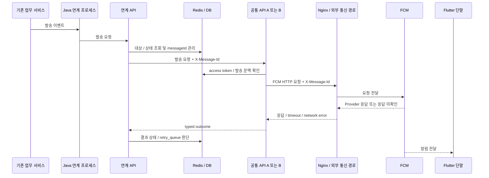

# 메시지 발송 흐름

## 기본 흐름



## `messageId`를 끝까지 유지

장애를 볼 때 Java, 연계 API, 공통 API, Redis 상태, Nginx와 FCM 호출을 하나의 발송으로
다시 이어 붙여야 했다.

그래서 Retry에서도 새로운 ID를 만들지 않고 원래 `messageId`를 유지한다.
이번 리팩토링에서는 HTTP 경로에도 `X-Message-Id`를 전달해 서비스와 프록시 로그를 같이 찾을 수 있게 했다.

```text
동일 논리 발송
→ 같은 messageId 유지
→ 서비스 로그 / 상태 / 외부 호출 correlation
```

실제 ID 생성 규칙은 공개하지 않는다.

## 결과 모델

1차 리팩토링에서 결과를 다음처럼 나눴다.

```text
accepted
skipped_unregistered
delivery_unknown
failed
```

- `accepted`: FCM 정상 응답 확인
- `skipped_unregistered`: 재확인까지 UNREGISTERED여서 무효 토큰으로 확정
- `delivery_unknown`: 요청은 시작됐을 수 있지만 응답을 확인하지 못해 실제 처리 여부를 모름
- `failed`: 미전송 또는 명시적인 실패로 판단 가능한 상태

기존 운영 metric 중 `delivered` 이름이 남아 있더라도, 현재 코드 결과 의미는 `accepted`에 더 가깝다.
단말 화면 표출 완료를 뜻하지 않는다.

## FCM 요청 전 실패와 요청 후 불명 상태

단순히 `response가 없다`는 이유만으로 모두 `delivery_unknown`으로 두면 안 됐다.
Redis access token 조회처럼 FCM 요청 전에 실패한 경우도 response가 없기 때문이다.

그래서 실제 FCM 호출 직전 request-started 상태를 추적한다.

```text
FCM 요청 전 실패
→ failed / retryable 판단

FCM 요청 시작
→ response 없음
→ delivery_unknown
→ 자동 Retry 금지
```

## Retry 판단

현재 코드 기준:

| 상황 | 결과 | 자동 Retry |
|---|---|---|
| 500 / 503 | failed | 제한적 |
| timeout / 502 / 504 | delivery_unknown | 하지 않음 |
| ECONNREFUSED / ENOTFOUND / EAI_AGAIN | failed | 조건부 가능 |
| 요청 시작 후 ECONNRESET 등 response 없음 | delivery_unknown | 하지 않음 |
| 재확인까지 UNREGISTERED | skipped_unregistered | 하지 않음 |

이 정책은 "가능하면 많이 다시 보낸다"보다 **이미 전달된 메시지를 중복으로 보내지 않는 것**을 더 중요하게 본 결과다.

## 다수 대상 발송

기존의 병렬 발송과 `Promise.allSettled` 구조는 유지한다.

```text
배치 요청
→ 개별 건 병렬 처리
→ 한 건의 실패를 다른 발송과 격리
→ 결과 분리 집계
```

이번 리팩토링의 중심은 병렬화 자체가 아니라 각 개별 발송의 결과 의미와 Retry 기준을 더 정확히 만드는 것이었다.

## 현재 검증 상태

```text
Code Changes                  COMPLETE
Development Deployment        COMPLETE
Normal Push E2E Smoke Test     PASS
Redis reconnect DEV           VALIDATED
Failure-path DEV Validation    PENDING
Production Deployment         PENDING
Production Validation         PENDING
```
