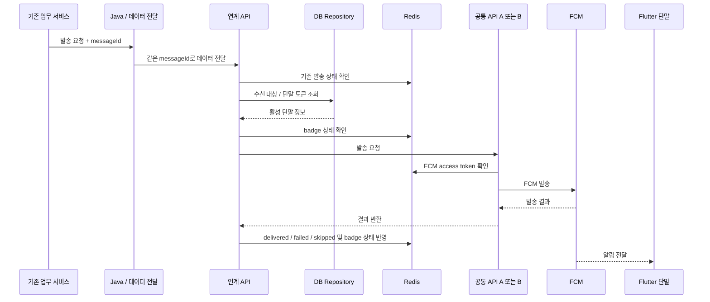

# 메시지 발송 흐름

## 기본 흐름



실제 서비스명과 내부 API 경로는 뺐지만, **호출 순서는 이 흐름에서 바꾸지 않았다.**

## `messageId`를 끝까지 유지한 이유

처음에는 서비스별 HTTP 로그만 봐도 될 것 같았다. 하지만 Java/데이터 전달, 연계 API, 공통 API, Redis 상태와 FCM 호출을 함께 봐야 하는 장애에서는 요청 하나를 다시 이어 붙이기가 어려웠다.

그래서 `messageId`를 다음 용도로 같이 사용했다.

- Java 이후 NestJS 서비스와 FCM 결과까지 로그 연결
- Redis에서 현재 발송 상태 조회
- 같은 요청이 다시 들어왔는지 판단
- 재시도나 운영 확인 때 원래 요청과 같은 건인지 확인

```text
같은 messageId + 같은 요청
→ 이미 처리 중이거나 끝난 결과를 확인
→ 새로운 논리 발송으로 만들지 않음
```

이 구조가 외부 FCM까지 포함한 exactly-once를 보장하는 것은 아니다. 다만 timeout이나 상위 연계의 재호출 때문에 같은 업무 요청이 새 발송으로 반복되는 위험을 줄이는 기준이 됐다.

## 수신 대상 조회와 Redis 상태를 나눈 이유

수신 대상과 단말 토큰은 DB Repository에서 조회한다. Redis에는 이를 통째로 복제하지 않고, 발송 과정에서 빠르게 공유해야 했던 상태만 둔다.

```text
DB Repository
→ 수신 대상 / 단말 토큰

Redis
→ FCM access token
→ badge 상태
→ messageId 발송 상태
→ 토큰 갱신 조정
```

이 구분은 공개를 위해 새로 만든 것이 아니라 실제 구조를 그대로 설명하기 위한 것이다.

## 다수 대상 발송

초기에는 대상을 순서대로 발송했다. 실단말 검증에서 대상 수가 늘어날수록 전체 도착 시간이 같이 늘어나는 것을 확인했고, 처리 방식을 바꿨다.

```text
요청 목록
→ 각 건을 병렬 발송
→ Promise.allSettled로 개별 결과 수집
→ delivered / skipped / failed 집계
```

핵심은 속도만 아니었다. 한 단말의 조회나 FCM 오류가 전체 목록의 나머지 발송을 멈추지 않도록 **실패 격리 단위를 개별 발송 건**으로 잡았다.

## 발송 상태

발송 상태는 `messageId` 기준으로 관리한다.

```text
queued
  ├─ delivered : FCM이 요청을 정상으로 받음
  ├─ skipped   : 발송 대상이 아니거나 발송 계층에서 재시도 불필요로 분류
  └─ failed    : 재시도·복구·추가 확인이 필요한 실패
```

`skipped`와 `failed`를 나눈 이유는 운영자가 다음에 할 일이 다르기 때문이다.

## timeout과 재시도

timeout은 특히 조심했다. 서버가 응답을 못 받았다고 해서 FCM이 요청을 받지 않았다고 단정할 수 없기 때문이다.

재시도는 다음을 함께 확인한다.

1. 일시적인 오류인지
2. 같은 `messageId`로 상태를 확인할 수 있는지
3. 다시 보내도 중복 발송 위험을 받아들일 수 있는지
4. 정해 둔 재시도 범위를 넘지 않았는지

`UNREGISTERED`는 발송 계층에서는 재확인 후 무효 토큰으로 확정되면 `skipped`로 분류한다. 다만 현재 상위 재시도 큐는 상태코드 분기가 완전히 적용되지 않아 **확정된 무효 토큰도 제한된 재시도 범위에서 다시 큐에 들어갈 수 있는 known gap**이 남아 있다. 이 부분은 [실패 처리와 UNREGISTERED](05-failure-handling.md)에 따로 적었다.

## 서버 발송 결과의 경계

이 문서에서 `delivered`는 FCM이 서버 요청을 정상으로 받아들였다는 뜻이다. Flutter 단말 표출까지 확정하려면 앱과 OS 수준의 별도 확인이 필요하며, 이 저장소는 그 보장을 주장하지 않는다.
