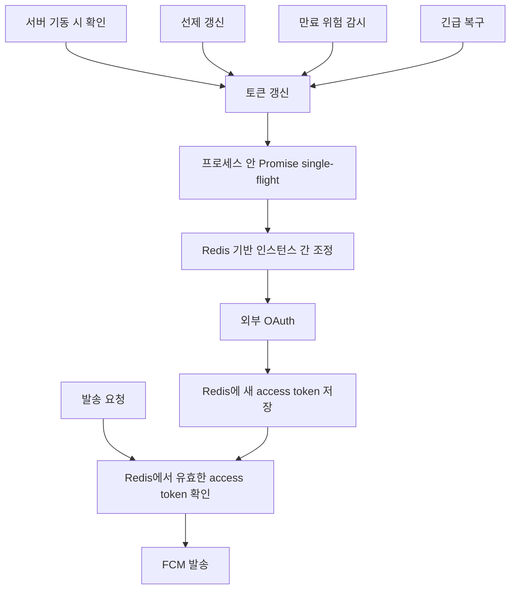

# FCM 토큰 갱신과 복구

## 운영에서 처음 드러난 문제

초기 구조에서는 발송 요청이 들어왔을 때 FCM access token이 없거나 만료되면 외부 OAuth로 새 토큰을 받았다.

```text
발송 요청
→ access token 확인
→ 없거나 만료됨
→ 외부 OAuth 호출
→ FCM 발송
```

서버를 다시 올린 직후에는 정상인데 access token 만료 주기가 가까워지면 504가 늘어나는 패턴이 보였다. 처음에는 Nginx, Redis, FCM 자체, 네트워크를 차례로 의심했다. 어느 것도 증상만으로는 확정할 수 없어서 발송 흐름의 구간별 시간을 직접 남겼다.

그 결과 Redis 조회와 FCM 호출보다 **그 앞의 OAuth 토큰 발급 구간이 오래 걸리고**, 그 지연이 공통 API와 상위 연계까지 그대로 전파되는 것을 확인했다.

## 단순 캐시로 끝나지 않았다

1차로 access token을 Redis에 저장했다. 정상 시간에는 외부 OAuth 호출이 줄었지만, 만료 시점에는 두 공통 API 인스턴스가 같은 캐시 miss를 보고 동시에 갱신할 수 있었다.

```text
공통 API A ─┐
             ├─ 같은 access token이 만료됨 → 외부 OAuth 동시 호출
공통 API B ─┘
```

캐시는 값을 저장할 뿐, 누가 갱신할지는 정해 주지 않는다. 그래서 동시성 범위를 둘로 나눴다.

- 한 프로세스 안: 진행 중인 Promise를 공유하는 single-flight
- 두 인스턴스 사이: Redis `SET NX`와 만료시간을 이용한 갱신 조정

정확한 lock key와 시간은 공개하지 않는다.

## 발송과 토큰 갱신을 분리



정상 발송은 Redis에 남아 있는 유효한 access token을 사용한다. 갱신은 다음 경로에서 미리 처리한다.

- 서버 기동: 기존 token 존재 여부와 만료 위험 확인
- 선제 갱신: 만료 전에 주기적으로 갱신하되, 두 인스턴스의 실행 시점을 분산
- 감시: 정기 갱신이 돌았다는 사실보다 실제 남은 유효시간을 확인
- 긴급 복구: token이 없거나 만료가 가까울 때 제한된 범위에서 다시 시도

외부 OAuth가 잠시 불안정할 때 기존 token이 아직 유효하면 발송은 계속할 수 있다. 다만 이것은 장애 원인을 없앤 것이 아니라, 영향을 발송 요청에서 잠시 떼어 둔 것이다.

## 애플리케이션 보완과 실제 원인을 분리

이후 토큰 갱신 실패가 다시 늘어난 사건에서는 애플리케이션 로직만 보지 않았다. 호스트, 컨테이너, 프록시, 외부 OAuth 순서로 같은 요청을 반복해 어느 구간부터 달라지는지 확인했다.

최종적으로 외부 통신 정책 변경으로 컨테이너의 OAuth 경로가 불안정해진 것이 확인됐고, 네트워크 담당 영역에서 정책을 바로잡았다. 내가 적용한 Redis, 재시도, 감시, 긴급 복구는 **사용자 영향을 줄인 애플리케이션 보완**이고, 외부 통신 정책 수정은 **원인 제거**였다.

둘을 같은 성과처럼 합치지 않는다.

## 모니터링

토큰 문자열 자체보다 다음을 봤다.

- Redis에 유효한 access token이 있는지
- 남은 유효시간이 위험 구간으로 들어가는지
- 정기 갱신이 실행됐는지와 실제 갱신 여부
- 갱신 실패가 연속되는지
- 두 인스턴스가 동시에 갱신하려 했는지
- 긴급 복구가 왜 실행됐고 성공했는지
- 외부 OAuth 응답시간과 오류가 평소보다 늘었는지

발송 성공률이 아직 정상이어도 토큰 갱신 실패가 누적되면 곧 만료로 이어질 수 있다. 그래서 발송 결과와 토큰 상태를 따로 봤다.

## 여기서 남은 판단

> Redis에 token을 넣는 것만으로는 부족했다. 만료 전에 갱신하고, 같은 갱신이 겹치지 않게 하고, 실패했을 때 누가 어떻게 복구할지까지 있어야 운영할 수 있었다.
