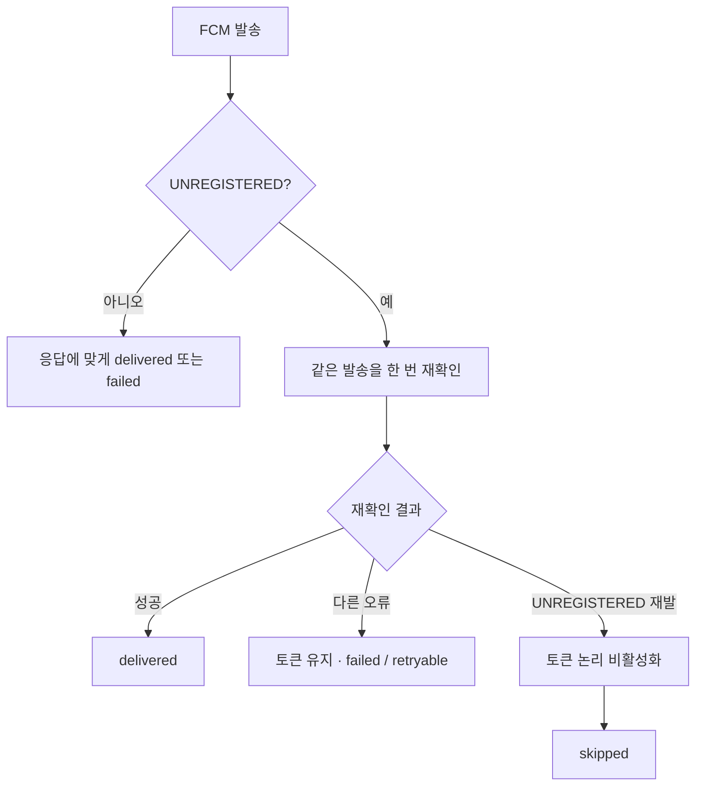

# 실패 처리와 UNREGISTERED

## 실패를 한 숫자로 보지 않게 된 이유

초기에는 FCM 발송이 정상 응답이면 성공, 아니면 실패로 보면 된다고 생각하기 쉽다. 운영에서는 같은 실패라도 다음 행동이 달랐다.

```text
delivered  FCM이 요청을 정상으로 받음
failed     일시 오류나 확인이 더 필요한 실패
skipped    발송 대상이 아니거나 재시도할 필요가 없는 건
```

앱을 삭제하거나 다시 설치하면 예전 단말 토큰이 더 이상 유효하지 않을 수 있다. 이때 나오는 `UNREGISTERED`를 timeout이나 5xx와 같은 실패로 세면 실제 장애 지표가 흐려지고, 의미 없는 재시도가 늘어난다.

## 현재 적용한 UNREGISTERED 처리

한 번의 `UNREGISTERED`만으로 단말 토큰을 바로 비활성화하지 않는다.



처리 순서는 다음과 같다.

1. 최초 `UNREGISTERED`를 받으면 단말 토큰을 그대로 둔다.
2. 같은 발송을 한 번 재확인한다.
3. 재확인이 성공하면 첫 응답을 일시적인 오류로 보고 `delivered`로 기록한다.
4. 재확인에서 다른 오류가 나면 토큰이 죽었다고 단정하지 않고 비활성화를 보류한다. 결과는 재시도 판단이 가능한 `failed`로 남긴다.
5. 재확인에서도 `UNREGISTERED`가 나오면 무효 토큰으로 확정한다.
6. 확정한 토큰은 물리 삭제하지 않고 논리 비활성화한다.
7. 해당 발송 결과는 발송 계층에서 일반 장애가 아닌 `skipped`로 기록하고 이후 활성 발송 대상에서 제외한다.

재확인 간격, DB 컬럼, 내부 상태 코드와 실제 API 응답값은 공개하지 않는다.

## 왜 즉시 삭제하지 않았나

운영에서 단말 토큰은 사용자와 발송을 연결하는 중요한 상태였다. 한 번의 응답만 믿고 삭제하면 멀쩡한 토큰까지 잃을 수 있다. 반대로 무효 토큰을 계속 살려 두면 같은 실패가 반복된다.

그래서 “한 번 더 확인하는 비용”을 감수하고, 확정 뒤에도 이력을 남길 수 있도록 논리 비활성화를 선택했다.

## 재시도 판단

| 상황 | 처리 | 재시도 |
|---|---|---|
| FCM 정상 응답 | delivered | 하지 않음 |
| 재확인도 UNREGISTERED | 토큰 비활성화 + sender 기준 skipped | 의도상 하지 않음* |
| timeout / 일시 5xx | failed | `messageId`와 재시도 범위 확인 후 조건부 |
| 잘못된 요청 | failed | 같은 요청 그대로는 하지 않음 |
| access token 사용 불가 | 발송보다 토큰 복구 상태 확인 | 제한된 복구 경로 사용 |
| 원인 미확정 | failed / unknown 사유 | 자동 반복보다 조사 우선 |

timeout은 FCM이 요청을 받았는지 애매할 수 있어 특히 조심한다. `messageId`로 기존 상태를 확인하지 않고 무조건 다시 보내지 않는다.

### 현재 남아 있는 known gap

발송 계층에서는 재확인된 `UNREGISTERED`를 재시도 불필요 상태로 분류한다. 하지만 상위 재시도 큐에서는 이 상태코드 분기가 아직 완전히 적용되지 않아, **논리 비활성화된 무효 토큰도 제한된 재시도 범위 안에서 다시 큐에 들어갈 수 있는 구간이 남아 있다.**

그래서 위 표의 “하지 않음”은 현재 전체 경로가 완전히 그렇게 동작한다는 뜻이 아니라, **sender가 의도한 최종 분류**를 뜻한다. 이 차이는 숨기지 않고 현재 개선 대상으로 남겨 둔다.

## 모니터링에서 분리

`skipped`를 실패율에서 빼기만 하고 숨기지는 않는다.

- `failed` 증가: FCM, OAuth, Redis, 네트워크 장애 후보 확인
- `skipped` 증가: 앱 설치 상태나 단말 토큰 생명주기 확인
- `UNREGISTERED` 재확인 성공 증가: 일시 오류 여부 확인
- 토큰 비활성화 증가: 앱 재등록 흐름과 함께 확인

같은 FCM 응답이라도 운영자가 해야 할 일이 다르면 상태도 분리해야 장애 판단이 빨라졌다.
