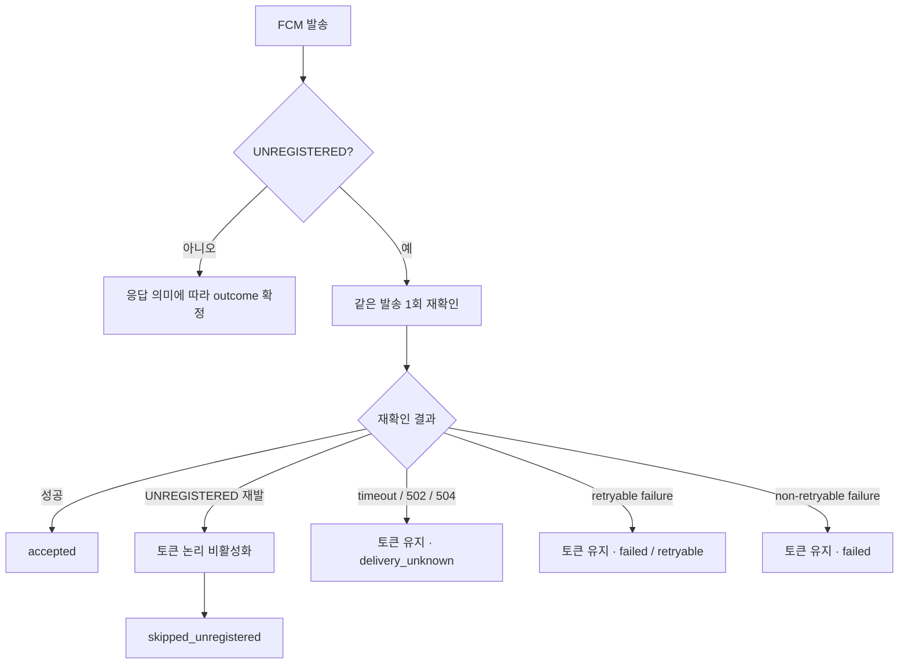

# 실패 처리와 UNREGISTERED

## 실패를 하나로 묶지 않는다

운영하면서 가장 크게 바뀐 판단 중 하나는 `failed` 하나로 모든 실패를 설명하면
Retry 기준도, 운영자가 확인할 위치도 흐려진다는 점이었다.

현재 내부 결과 의미는 다음 네 가지다.

| 결과 | 의미 |
|---|---|
| `accepted` | FCM 정상 응답을 확인함 |
| `skipped_unregistered` | 재확인까지 UNREGISTERED여서 무효 토큰으로 확정 |
| `delivery_unknown` | 요청은 시작됐을 수 있으나 응답을 확인하지 못해 처리 여부 불명 |
| `failed` | 미전송 또는 명시적인 실패로 판단 가능한 상태 |

`accepted`는 단말 표출 완료가 아니다.

## `delivery_unknown`

timeout이나 502/504를 보면 다시 보내고 싶어진다. 하지만 한 운영 사례에서는
upstream connection과 request 전달 정황이 있었고 response만 확인하지 못했다.

이 상태에서 자동 Retry를 하면 이미 처리된 메시지를 다시 보낼 수 있다.

그래서 현재 코드는:

```text
timeout / 502 / 504
→ delivery_unknown
→ retryable=false
```

로 본다.

외부 Root Cause가 확정됐다는 뜻은 아니다. "원인은 모른다"와 "재시도 의미를 정할 수 없다"는
같은 말이 아니기 때문에, Root Cause는 UNKNOWN으로 유지하면서도 중복 위험을 줄이는 정책은 코드에 반영했다.

## 명확한 실패

FCM 요청 전에 연결 자체가 실패했다고 판단 가능한 오류는 `failed`로 분리한다.

예:

```text
ECONNREFUSED
ENOTFOUND
EAI_AGAIN
```

이런 오류는 FCM 요청이 시작됐을 가능성이 낮은 경우에 한해 retryable하게 판단할 수 있다.

500/503도 제한된 범위에서 Retry한다. 횟수와 실제 내부 설정값은 공개하지 않는다.

## `UNREGISTERED` 재확인

최초 `UNREGISTERED`를 받았다고 즉시 토큰을 비활성화하지 않는다.



이번 1차 리팩토링에서 중요하게 본 것은 **재확인에서 다른 오류가 났다고 해서 토큰이 무효라고
확정하지 않는 것**이다.

- 재확인 성공 → `accepted`
- 재확인도 UNREGISTERED → 논리 비활성화 + `skipped_unregistered`
- 재확인 timeout/502/504 → 토큰 유지 + `delivery_unknown`
- 다른 실패 → 토큰 유지 + `failed`

## 결과와 후처리 분리

FCM 요청 결과와 그 뒤의 로그/Redis 저장은 같은 실패가 아니다.

기존 코드에서는 FCM 성공 뒤 PushLog 저장이 실패하면 같은 catch로 들어가
이미 확인한 성공이 실패처럼 처리될 가능성이 있었다.

현재 1차 리팩토링에서는:

```text
FCM Result
→ outcome 먼저 확정
→ PushLog / Redis status / token 후처리
```

순서로 경계를 나눴다.

후처리가 실패해도 이미 확정한 Provider outcome을 다시 실패로 바꾸지 않는다.

## 현재 검증 상태

코드 변경과 정상 Push E2E Smoke Test는 개발환경에서 확인했다.
다만 timeout/502/504 → `delivery_unknown=true`, retryable 오류, UNREGISTERED 등 failure-path 검증과 운영 검증은 남아 있다.
따라서 이 문서의 정책을 "오류 경로 전체/운영 효과 검증 완료"로 읽으면 안 된다.
